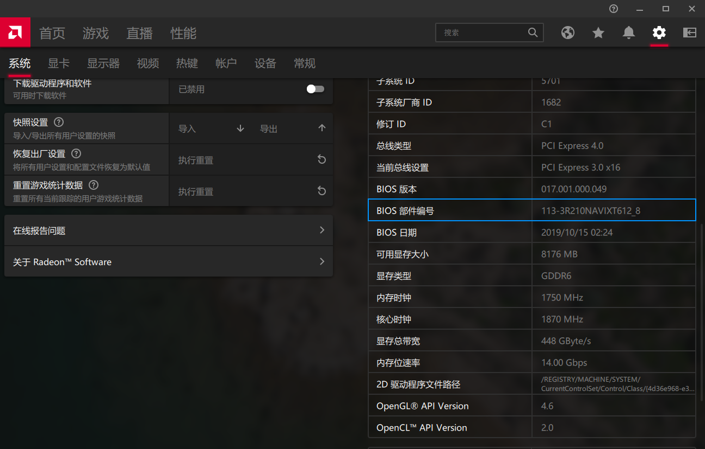
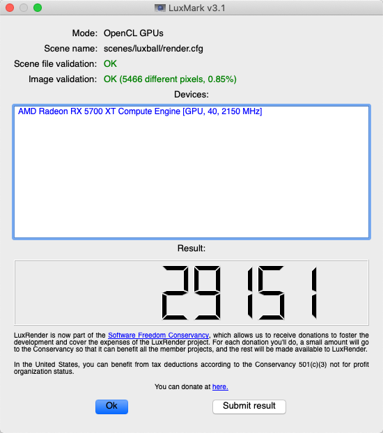

# HOW TO TUNE AMD RX5700XT

## HOW TO INJECT FB NAME

1. Open AMD Control Center(Windows)
2. Open Settings -> System, Copy the BIOS Part Number
3. Replace the value of ATY,EFIVersionB in RadeonBoost.kext by step 2
4. Copy RadeonBoost.kext to EFI/CLOVER/kexts/Other
5. Rebuild kextcache and reboot

## HOW TO CUSTOM GPU PP_PhmSoftPowerPlayTable

1. Use GPU-Z(Windows) export BIOS
2. Use MorePowerTool(Windows) open BIOS file
3. Fill xlsx values from step 2
4. Copy output and inject PP_PhmSoftPowerPlayTable by Clover SSDT or RadeonBoost.kext
5. Rebuild kextcache and reboot

